# A method for recognizing bird species


:bird:


## Results

A classification result taken directly from the nature camera
<br/>
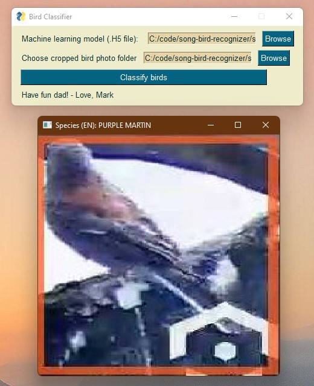
<br/>


A second result
<br/>
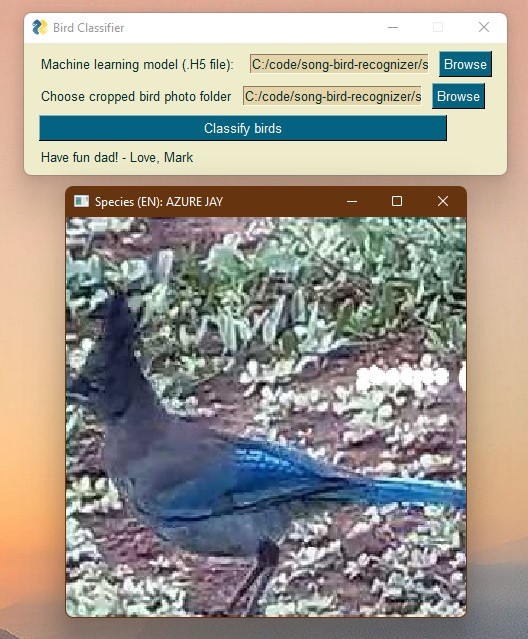
<br/>

## Install and use

Download the pre-trained model .H5 file from [this link](https://www.kaggle.com/datasets/gpiosenka/100-bird-species).

The network is called
```
EfficientNetB4-BIRDS-0.99.h5
```

Pip install these

```
numpy
keras
tensorflow
opencv2-python
PySimpleGUI
```

Run it like this 

```
C:\my\path\to\song-bird-recongizer>python controller.py
```
<br/>
:hatching_chick:
<br/>
:hatched_chick:

### The story

A few years back my dad installed an Amcrest IP4M-1053EW on his property in Arizona
<br/>
<br/>
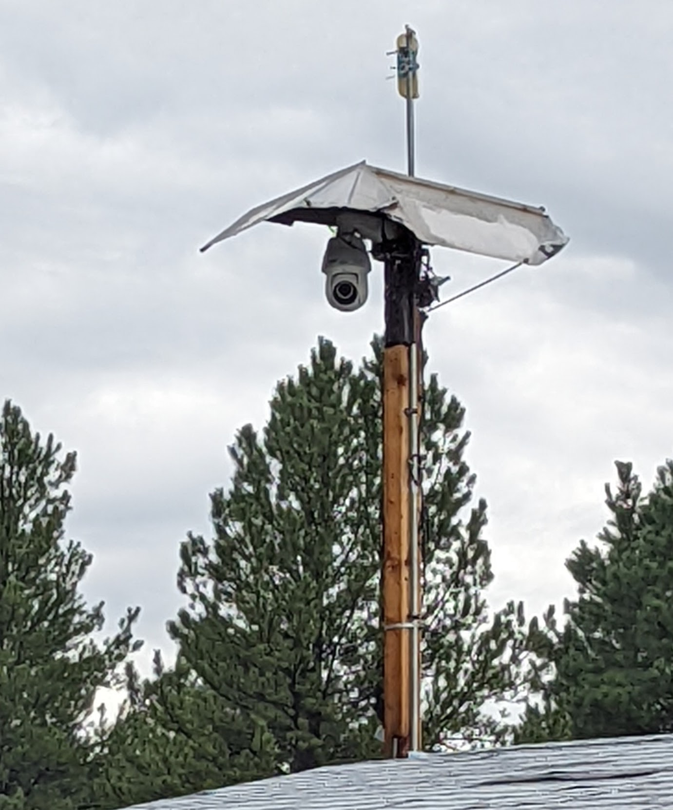
<br/>
I recently visited and we were both interested by the idea of using his nature cam to build an
end-to-end bird classifier. A few years back I had made an antenna system for him to be able to access
broadband LTE as a home internet solution. Our [first project during this year's visit](https://github.com/mmusil25/handmade-LTE-antenna) 
was to build an LTE antenna out of copper tubing in order to extend the range of the indoor LTE repeater. 
Once I established a wireless LAN I realized that I could connect his nature camera over IP to my computer.

<br/>
Here's the connection between the IP camera (blue CATx) and the LAN (tan CATx) over an unmanaged switch. 
<br/>
<br/>
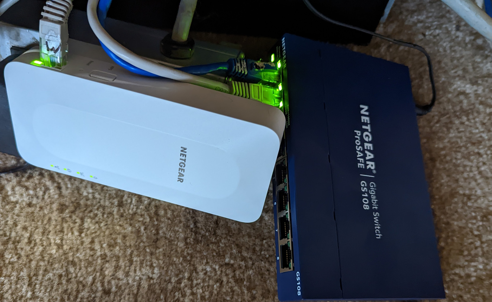
<br/>

We had installed two WiFI mesh nodes to repeat the available 5 GHz network
and to use the range extenders as unmanaged switches. These provided a network access point for both the 
Amcrest camera (IP4M-1053EW) as well as two client terminals. The client terminals were on the some
local network (via the WiFi extenders) which allowed me to access the camera over IP using Blue Iris. 

I configured Blue Iris to take snapshots of activity centered around the bird feeder in my father's yard. Here is a 
picture of the input frame that was monitored continuously. You can see in this image that an orange rectangle is used to center
focus around the birds.  

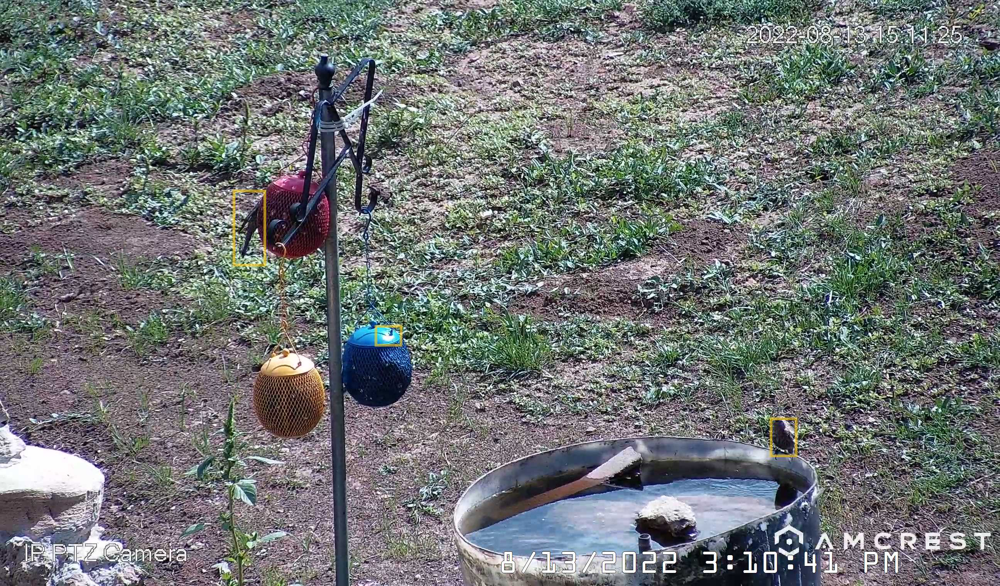
_The view field of the nature camera which received input_

When a bird enters the frame of the camera Blue Iris takes a snapshot and deposits that snapshot in its default path

```
C:/BlueIris/New
```

The user is then expected to crop the image down to the orange or yellow rectangle defining the bird they want to classify. 
<br/>

An example of a cropped image ready for input
<br/>
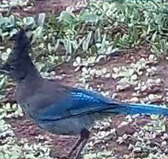
<br/>

And another
<br/>

<br/>

---

The user saves the cropped images under 

```
./snapshots_input_dir/
```

At runtime, the user selects the network file and snapshot input directory. You can find [that network here](https://www.kaggle.com/datasets/gpiosenka/100-bird-species).

The network is called

```
EfficientNetB4-BIRDS-0.99.h5
```

All cropped images then proceed into the neural network after being squashed to shape=(112,112,3) by tensorflow. 
The neural network was not trained in house but instead was loaded from an existing premade network (.H5 file). This design
decision was a matter of prudence and scope. The mobile development laptop I'm using could not handle the workload of
training. 

### SysML diagrams

#### System Requirements
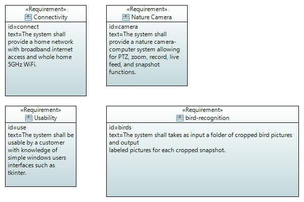

#### General domain
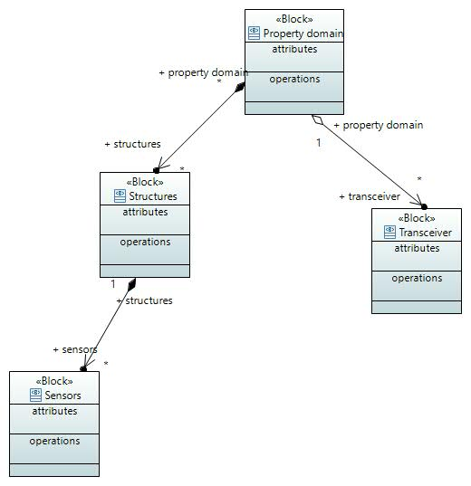

#### Home network domain
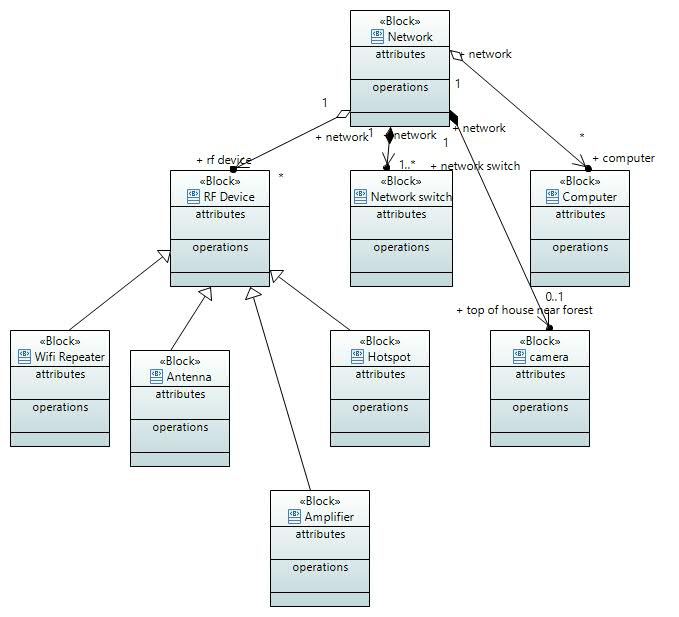

#### Nature camera state machine


#### User flow
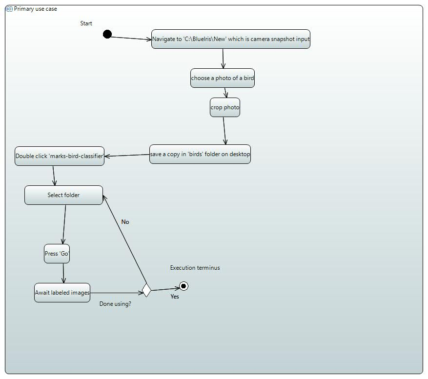

#### Primary Use Case
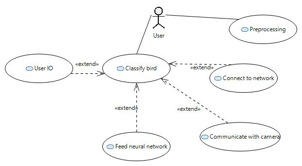


#### Network internal block diagram
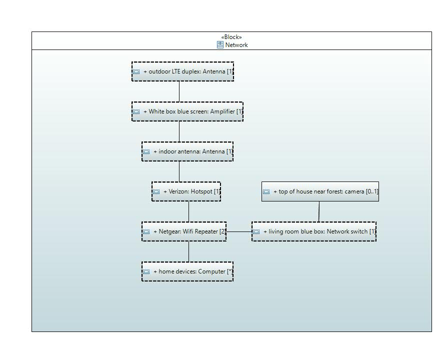
#### 


### Sources

[keras intro](https://keras.io/getting_started/intro_to_keras_for_engineers/)

[the dataset](https://www.kaggle.com/datasets/gpiosenka/100-bird-species)

[how to read in jpg](https://moonbooks.org/Articles/How-to-import-load-an-image-in-python-/#import-an-image-using-matplotlib)

[find a rectangle using opencv](https://www.delftstack.com/howto/python/opencv-detect-rectangle/#:~:text=Use%20the%20findContours%20%28%29%20and%20contourArea%20%28%29%20Function,to%20sort%20different%20rectangles%20according%20to%20their%20area.)

[color sampler - useful for image preprocessing](https://imagecolorpicker.com/)

