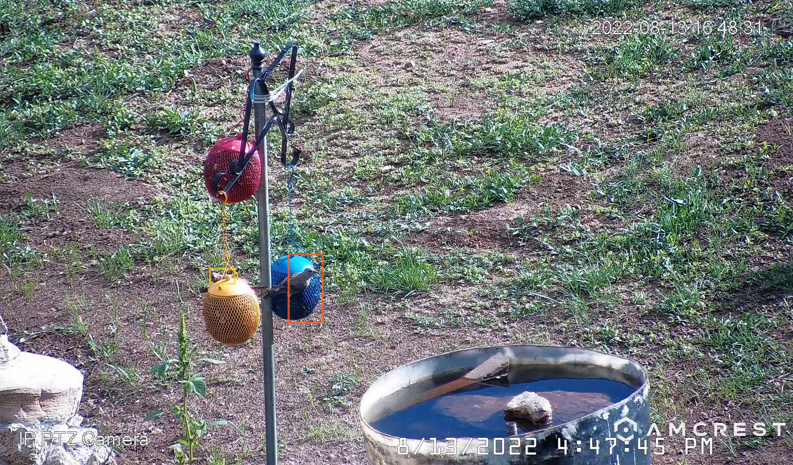
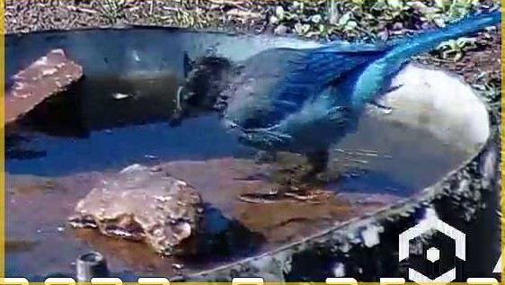
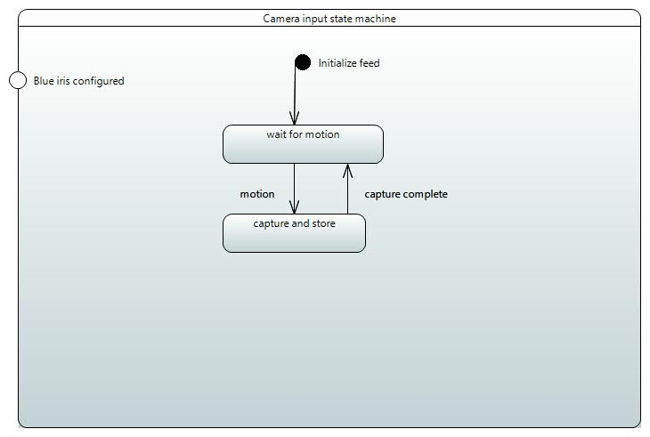

# song bird classifier

## Results

A classification result taken directly from the nature camera
 

 

A second result
 

 

## Installation and usage

### The story

I recently visited my father and we were both interested by the idea of using his nature cam to build an
end-to-end bird classifier. A few years back I had made an antenna system for him to be able to access
broadband LTE as a home internet solution. Our [first project during this year's visit](https://github.com/mmusil25/handmade-LTE-antenna) 
was to build an LTE antenna out of copper tubing in order to extend the range of the indoor LTE repeater. 

This bird classification project was an offshoot of my other goal which was to configure broadband access for
my dad. Once I established a wireless LAN I realized that I could connect the 

Once the hotspot had a reliable LTE input, we installed two WiFI mesh nodes to broadband the available 5 GHz network
and to use the range extenders as unmanaged switches. These nodes then provided a network access point for both the 
Amcrest camera (IP4M-1053EW) as well as two client terminals. The client terminals were on the some
local network (via the WiFi extenders) which allowed me to access the camera over IP using blue iris. 

I configured Blue Iris to take snapshots of activity centered around the bird feeder in my father's yard. Here is a 
picture of the input frame that was monitored continuously. You can see in this image that an orange rectangle is used to center
focus around the birds.  

_The view field of the nature camera which received input_

When a bird enters the frame of the camera BlueIris takes a snapshot and deposits that snapshot in its default path

'''
C:/BlueIris/New
'''

The user is then expected to crop the image down to the orange or yellow rectangle defining the bird they want to classify. 
 

An example of a cropped image ready for input
 

 

And another
 

 

The cropped imagesgo directly into the neural network after being squashed to shape=(112,112,3). 
The neural network was not trained in house but instead was loaded from an existing premade network (.H5 file). 
You can find [that network and the dataset here](https://www.kaggle.com/datasets/gpiosenka/100-bird-species).

The network is called

'''
EfficientNetB4-BIRDS-0.99.h5
'''

### SysML diagrams

#### System Requirements

#### General domain

#### Home network domain

#### Nature camera state machine

#### User flow

#### Primary Use Case

#### Network internal block diagram

#### 

### Sources

[keras intro](https://keras.io/getting_started/intro_to_keras_for_engineers/)

[the dataset](https://www.kaggle.com/datasets/gpiosenka/100-bird-species)

[how to read in jpg](https://moonbooks.org/Articles/How-to-import-load-an-image-in-python-/#import-an-image-using-matplotlib)

[find a rectangle using opencv](https://www.delftstack.com/howto/python/opencv-detect-rectangle/#:~:text=Use%20the%20findContours%20%28%29%20and%20contourArea%20%28%29%20Function,to%20sort%20different%20rectangles%20according%20to%20their%20area.)

[color sampler - useful for image preprocessing](https://imagecolorpicker.com/)

